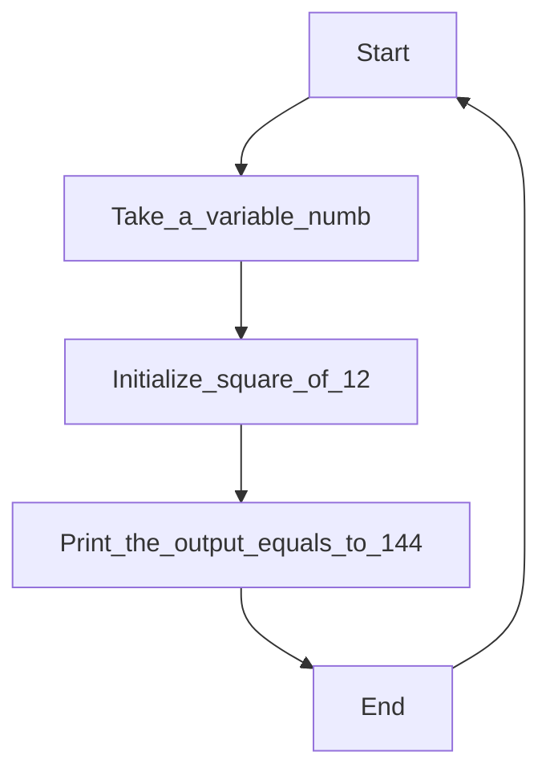

```mermaid

graph TD;

    Start-->Take_a_variable_numb;

    Take_a_variable_numb-->Initialize_square_of_12;

    Initialize_square_of_12-->Print_the_output_equals_to_144;
    
    Print_the_output_equals_to_144-->End
    
    End-->Start

    
    


    

```
